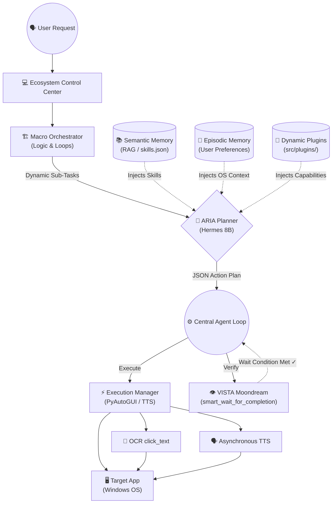

# Forge: Local, Multi-Modal Automation Agent

Forge is a local, privacy-first Windows OS automation agent designed to help individuals control their computers using voice commands and hand gestures. 

By tying together local reasoning models (Hermes 2 Pro via LM Studio) and multimodal visual verification (Moondream, PyTesseract), Forge provides hands-free, intelligent operation of the Windows desktop.

---

## 🗺️ Architecture Flowchart



---

## Features (Phases 1-12)

* **🧠 Multi-Stage Agentic Reasoning**: Uses **Hermes 2 Pro 8B** to convert complex voice instructions into structured JSON plans. Uses a Macro Orchestrator to break down massive tasks into logical loops.
* **👁️ VISTA (Visual Verification)**: Uses a local Moondream vision model to verify OS states before proceeding (e.g., waiting for an app to load).
* **🎯 Coordinate OCR**: Bypasses rigid UI rules by finding and clicking the exact `(x, y)` coordinates of any text on the screen using PyTesseract.
* **📚 Semantic & Episodic Memory**: Self-heals by learning successful workflows and permanently storing user preferences and facts across sessions.
* **🗣️ Asynchronous Local TTS**: Talks back naturally using a non-blocking background voice synthesizer.
* **🔌 Dynamic Plugin Architecture**: Extensible design. Drop a `.py` script into `src/plugins/`, and the AI instantly learns how to use it.
* **🔒 100% Local & Private**: No cloud APIs required. Your screen and data stay on your machine.

---

## Prerequisites & Installation

### 1. Set Up Local Models
* **LM Studio:** Download and run [LM Studio](https://lmstudio.ai/). Load a function-calling model like **`Hermes-2-Pro-Llama-3-8B-GGUF`** and start the local server on port `1234`.
* **Ollama (Vision):** Install [Ollama](https://ollama.com/) and run `ollama pull moondream`.

### 2. Install Tesseract OCR
For visual capabilities to work, you must install Tesseract:
* **Windows:** Download and install the [Tesseract-OCR executable](https://github.com/UB-Mannheim/tesseract/wiki). Ensure the installation path is added to your Windows Environment Variables.

### 3. Install Project Dependencies
1. Clone the repository:
   ```bash
   git clone https://github.com/Anikesh0415/Forge.git
   cd Forge
   ```
2. Activate your virtual environment and install dependencies:
   ```bash
   python -m venv venv
   .\venv\Scripts\activate
   pip install -r requirements.txt
   ```

---

## Usage

1. Start your local model servers (LM Studio on port `1234`, Ollama).
2. Run the server script:
   ```bash
   python server.py
   ```
3. Open the locally served dashboard at `ui/index.html` (or run `Start_Ecosystem.bat`).

---

## Contributing & License
Distributed under the MIT License. Pull requests are welcome to help harden the system, build new plugins, and improve local execution!
